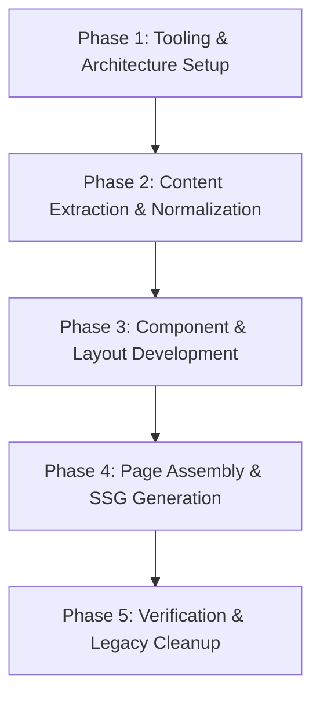

# Architecture & Migration Plan: Modernizing JDC Site with Astro & Decoupled CMS

## Executive Summary & Problem Statement

The current Java Developers' Conference site (located in the `2025` directory) relies on an imperative, client-side rendering model where a 36KB monolithic `payload.json` file is fetched at runtime by vanilla JavaScript scripts (`script.js`, `sessions.js`, `common.js`). This architecture presents several key issues:
1. **Client-Side Rendering Overhead & SEO Penalties**: HTML documents (`index.html`, `sessions.html`, `schedule/index.html`) are blank skeleton files. Search engines and social media scrapers see empty markup until scripts execute.
2. **Aggressive Caching & Service Worker Fragility**: To facilitate offline access and performance, a custom `service-worker.js` and `generate-manifest.js` script were introduced. This caused acute browser caching bugs, requiring manual version bumping (`cache-v...`) and query-string cache-busters (`?v=Date.now()`).
3. **Content/Presentation Coupling**: Conference copy, speaker bios, session abstracts, and team records contain raw inlined HTML strings (`<p>`, `<strong>`, `<a href...>`) embedded in a single JSON payload. Updating speaker details or schedules requires editing JSON strings with escaped characters, without schema safety or validation.

### Modernization Objective
Modernize the site using **Astro** for static site generation (SSG), completely decoupling the content management system (CMS) at the repository stage from the presentation interface. The build output will be 100% pre-rendered static HTML with content-hashed assets, eliminating client-side data fetches and browser caching issues.

---

## Current Site Assessment (2025 Site)

| Area | Current Implementation (2025) | Modernized Target (Astro) |
| :--- | :--- | :--- |
| **Rendering Engine** | Client-side imperative DOM generation via vanilla JavaScript | Static Site Generation (SSG) at build time with Astro |
| **Content Storage** | Monolithic `2025/assets/data/payload.json` with embedded raw HTML | Decoupled YAML and Markdown files organized by entity collections |
| **Content Validation** | None (runtime schema errors crash DOM rendering) | Strict compile-time validation via Astro Content Collections (Zod schemas) |
| **Asset & Caching** | Custom Service Worker + `manifest.json` + `?v=Date.now()` query hacks | Native content-hashed bundles (`_astro/[name].[hash].[ext]`) with immutable caching |
| **Pages & Routes** | 3 disparate HTML files (`index.html`, `sessions.html`, `schedule/index.html`) | File-based routing (`src/pages/index.astro`, `sessions.astro`, `schedule/index.astro`) |
| **Styling** | 3 standalone CSS files (`styles.css`, `sessions.css`, `schedule.css`) with shared rules | Modular component scoped styles + shared global design tokens/variables |
| **Interactivity** | Heavy vanilla JS manipulating DOM (1,900+ LOC across 3 files) | Zero-JS default; client islands only for interactive widgets (e.g. countdown, modal) |

---

## Architectural Blueprint

### 1. Decoupled Content Structure (`content/`)
The content layer will live independently in a dedicated `content/` hierarchy at the root level, separating non-technical editorial workflows from code development.

```text
├── content/
│   ├── site.yml                 # Global site metadata (conference brand, edition, nav, footer, social links, venue)
│   ├── pages/                   # Block-based page definitions & layout configurations
│   │   ├── home.yml             # Homepage section arrangement, hero copy, why-jdc points
│   │   ├── sessions.yml         # Sessions catalog headers, filters, track definitions
│   │   └── schedule.yml         # Schedule page headers and timeline metadata
│   └── collections/             # Repeatable, schema-validated entities
│       ├── speakers/            # One file per speaker (e.g., bazlur-rahman.md)
│       │                        # Frontmatter: metadata, social links, company, role, photo
│       │                        # Body: Rich Markdown biography
│       ├── sessions/            # One file per session (e.g., modern-java.md)
│       │                        # Frontmatter: track, duration, time, speaker reference ID, tags
│       │                        # Body: Session abstract in Markdown
│       ├── team/                # Organizing team member definitions (.yml / .json)
│       ├── sponsors/            # Sponsor definitions by tier (Platinum, Gold, Community)
│       └── agenda/              # Chronological conference timetable items mapping times to session IDs or breaks
```

#### Content Modeling Principles
- **Separation of Concerns**: Editorial copy lives in plain text (Markdown/YAML), never in JavaScript files or HTML templates.
- **Relational Integrity**: Sessions reference speakers by unique identifier (`speaker: bazlur-rahman`), and agenda slots reference session identifiers.
- **Markdown over Inlined HTML**: Bios and abstracts transition from escaped HTML strings (`<p>...<a href=...`) to standard Markdown syntax.
- **Schema Safety**: Astro's Content Layer API validates all entity fields at build time. Missing photos, broken links, or missing required fields cause build errors before deployment.

---

### 2. Interface & Component Architecture (`src/`)
The presentation layer consumes data from the content layer via type-safe collection queries and renders accessible, semantic HTML.

```text
├── src/
│   ├── components/
│   │   ├── global/              # Shared structural elements (Navbar.astro, Footer.astro, BackgroundGlow.astro)
│   │   ├── home/                # Homepage section blocks (Hero.astro, About.astro, WhyJdc.astro, Gallery.astro, etc.)
│   │   ├── sessions/            # Sessions components (SessionsGrid.astro, SessionCard.astro, SpeakerBioModal.astro)
│   │   ├── schedule/            # Schedule components (TimelineTable.astro, TimeSlotRow.astro)
│   │   └── ui/                  # Atom-level primitives (Button.astro, Badge.astro, Modal.astro)
│   ├── layouts/
│   │   └── BaseLayout.astro     # Root HTML layout (meta tags, OpenGraph, Favicon, fonts, persistent nav/footer)
│   ├── pages/
│   │   ├── index.astro          # Compiles home sections from content/pages/home.yml
│   │   ├── sessions.astro       # Compiles full session listing from content/collections/sessions/
│   │   └── schedule/
│   │       └── index.astro      # Compiles timetable from content/collections/agenda/
│   └── styles/
│       ├── tokens.css           # Colors, glow variables, typography scales extracted from existing CSS
│       └── global.css           # Global resets and shared animations
```

#### Client Hydration & Islands Architecture
- **Zero-JS Default**: Static sections (Hero, About, Gallery, Sponsors, Venue, Team, Session Cards, Schedule Table) ship zero client-side JavaScript.
- **Selective Islands**:
  - `CountdownTimer`: Hydrated on client (`client:idle` or standard web component) to count down to conference start date.
  - `SpeakerModal`: Accessible native `<dialog>` or lightweight island to display speaker bios when clicked from session cards.
  - `SessionFilter`: Lightweight island or URL query parameter handling for filtering tracks (Technical, Academia, etc.).

---

### 3. Static Build & Asset Caching Strategy
Browser caching was a major pain point in the 2025 site, leading to manual version bumping and unstable service workers. The modernized Astro architecture resolves this intrinsically:

1. **Elimination of Custom Service Worker**:
   - The custom `service-worker.js` and `generate-manifest.js` will be removed.
   - For a public conference site where updates (schedule changes, speaker additions) must be visible immediately to users, aggressive service-worker caching adds complexity and failure modes.
2. **Deterministic Content Hashing**:
   - Astro compiles all CSS, bundled scripts, and processed images into `dist/_astro/[name].[hash].[ext]`.
   - Asset URLs change automatically if and only if file contents change.
3. **HTTP Cache Control Strategy**:
   - Static HTML documents (`index.html`, `sessions/index.html`, `schedule/index.html`): Configured with `Cache-Control: public, max-age=0, must-revalidate` (or CDN edge revalidation).
   - Bundled assets (`_astro/*`): Configured with `Cache-Control: public, max-age=31536000, immutable`.
   - This ensures visitors always receive the latest HTML instantly, while all heavy assets remain permanently cached without collision or stale content issues.

---

## Migration Roadmap (Phased Execution)



### Phase 1: Tooling & Workspace Setup
- Initialize Astro in the project root with standard build tooling (npm).
- Configure Astro content collections with Zod schemas matching the conference data model.
- Extract design tokens and CSS variables from existing `2025/assets/css/styles.css` into `src/styles/tokens.css`.
- Ensure directory setup strictly respects repository rules (no modifications to `2024/`).

### Phase 2: Content Extraction & Normalization
- Deconstruct `2025/assets/data/payload.json` into the decoupled `content/` structure:
  - Migrate speaker entries into individual markdown files under `content/collections/speakers/`.
  - Convert HTML string abstracts into clean Markdown in `content/collections/sessions/`.
  - Extract team members, sponsors, and schedule timeline into structured YAML files.
  - Extract site-wide settings (SEO, venue, navigation, social links) into `content/site.yml`.
  - Place page-level configurations into `content/pages/`.
- Transfer and organize static media (speaker photos, gallery photos, sponsor logos, icons) into Astro's asset pipeline.

### Phase 3: Component & Layout Development
- Implement `BaseLayout.astro` preserving existing conference visual identity (dark theme, glow orbs, responsive navbar, footer).
- Port HTML/CSS structures from `script.js`, `sessions.js`, and `schedule/index.html` into clean Astro components.
- Replace imperatively generated modal logic with accessible semantic components.
- Implement the countdown widget as an isolated Astro island.

### Phase 4: Page Assembly & Routing
- Assemble `src/pages/index.astro` using modular components fed by `content/pages/home.yml` and collection queries.
- Assemble `src/pages/sessions.astro` rendering all sessions and linked speaker data.
- Assemble `src/pages/schedule/index.astro` displaying the event timeline with links to sessions.
- Verify internal linking, anchor navigation (`#about`, `#speakers`, `#venue`, etc.), and responsive mobile navigation.

### Phase 5: Verification & Legacy Deprecation
- Execute `npm run build` to verify full static generation produces clean HTML in `dist/`.
- Validate zero broken links, schema conformance, and image optimization.
- Document production deployment and content editing workflows in repository guides.

---

## Clarification Points

> 1. **Directory Placement**: The plan proposes placing Astro source files at the project root (`src/`, `content/`, `public/`) for the primary site build. No need to keep the `2025` folder after the migration is done. It will still be available in `2025` branch in remote.
> 2. **Content Format**: Markdown (`.md`) with YAML frontmatter is chosen for speakers and sessions to eliminate raw HTML strings from JSON.
> 3. **Service Worker Removal**: Confirmed removal of `service-worker.js` and `generate-manifest.js` in favor of standard HTTP caching headers and Astro asset hashing.
